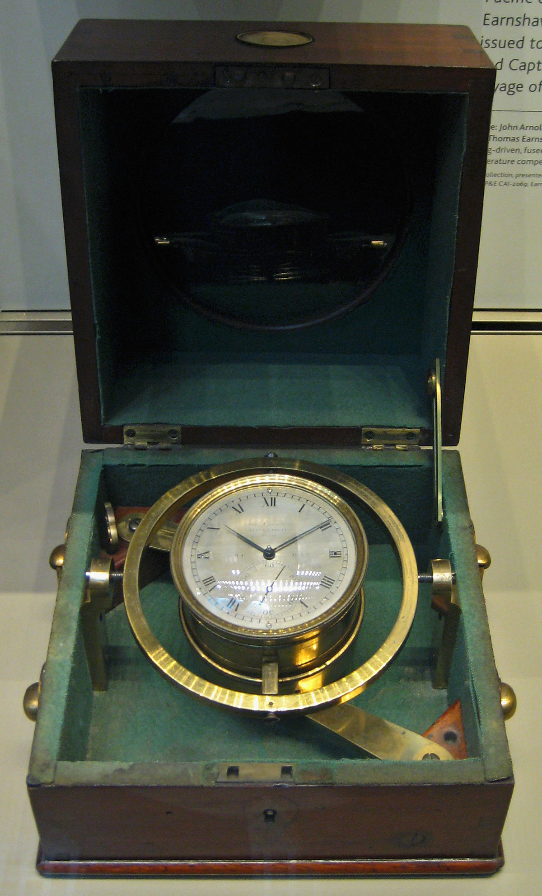
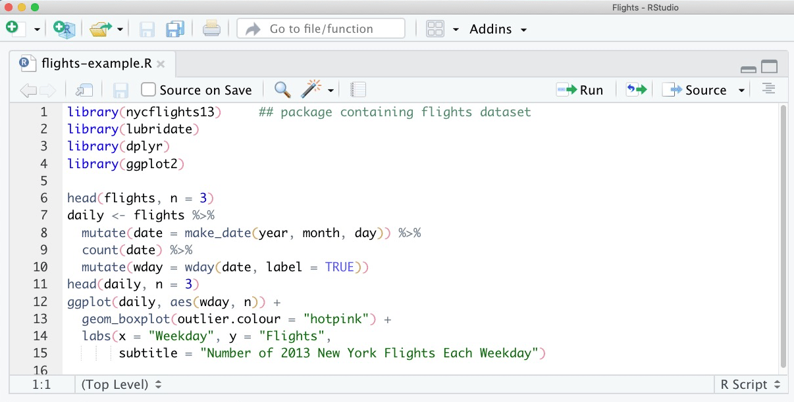
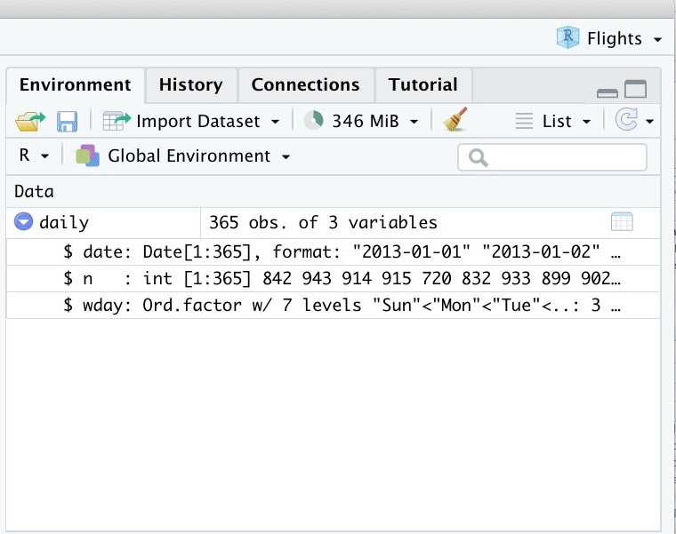
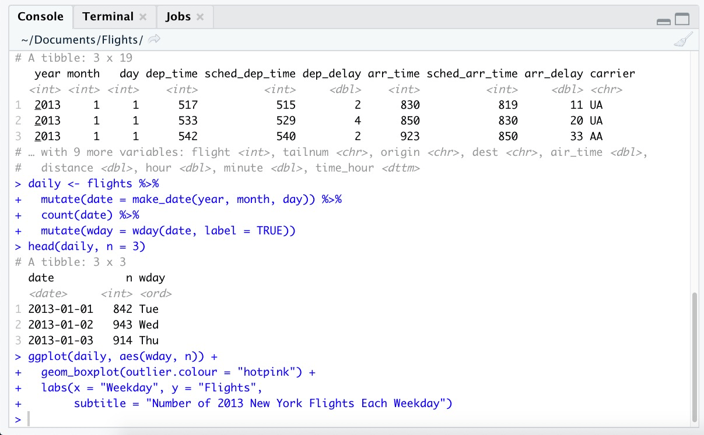
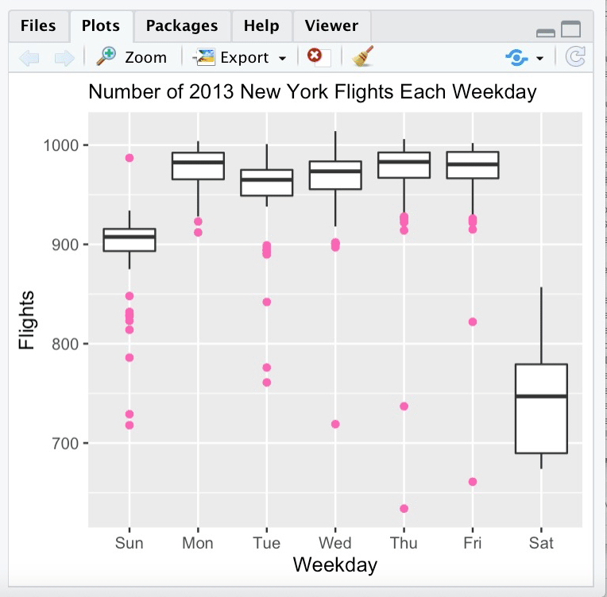
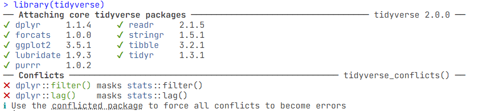
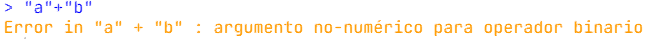
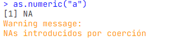

## La revolución de los datos espaciales

En el **siglo pasado:**

.pull-left[
- Existía una aguda escasez de datos y herramientas para el análisis geográfico.

- Los primeros geógrafos utilizaron diversas herramientas, como barómetros, brújulas y sextantes, para avanzar en el conocimiento del mundo
]

.pull-right[
```{r, echo=FALSE}

```
]
---
## La revolución de los datos espaciales

**Por ejemplo: **

.pull-left[
- Solo con la invención del cronómetro marino en 1761 fue posible calcular la longitud en el mar, lo que permitió a los barcos tomar rutas más directas.
]

.pull-right[
```{r, echo=FALSE, out.width= "80%"}

```

]

---
## La revolución de los datos espaciales

En la **actualidad:**

.pull-left[
### Existe el problema contrario: demasiados datos; demasiadas herramientas]

.pull-right[
- La mayoría de los teléfonos disponen ya de un receptor de posicionamiento global (GPS). 

- Datos de sensores satelitales.

- Científicos ciudadanos miden incesantemente cada rincón del mundo.
]

.center[

```{r, echo=FALSE, out.width= "55%"}


```

]
---
## La revolución de los datos espaciales

.center[
###Esta revolución de los datos espaciales impulsa la demanda de hardware informático de alto rendimiento y software eficiente y escalable para manejar y extraer la señal del ruido.
]

```{r, echo=FALSE}

knitr::include_graphics("img/ejemplo_software.jpg")

```


---
# Software Libre 

El software libre se presenta como una alternativa particularmente atractiva porque ofrece a los usuarios un conjunto de libertades esenciales: ejecutar, copiar, distribuir, estudiar, modificar y mejorar el software.

Y las ventajas que esto ofrece son: 

- Ritmo de desarrollo y longevidad

- Interoperabilidad

- Reproductibilidad

- Comunidad

---
# Software Libre 

## Ritmo de desarrollo y longevidad

Cientos de personas envían cada día informes de errores y sugieren nuevas funciones y mejoras de la documentación de los proyectos de código abierto.

---
# Software Libre 

## Interoperabilidad

Mientras que los productos patentados tienden a ser monopolios difíciles de mantener, el software de código abierto es más parecido a una federación de herramientas modulares que pueden combinarse de diferentes maneras.

---
# Software Libre 

## Reproductibilidad

El software de código abierto elimina una importante barrera a la reproducibilidad al permitir que otros comprueben sus hallazgos o apliquen sus métodos en nuevos contextos utilizando las mismas herramientas.

---
# Software Libre 

## Comunidad

La comunidad le permite obtener soporte mucho más rápido y, a menudo, de mayor calidad que con un equipo de soporte centralizado.


---
# Progreso de software geoespacial

- En las últimas décadas gracias a organizaciones como [OSGeo](https://www.osgeo.org/), las técnicas geográficas avanzadas ya no son un privilegio exclusivo de aquellos con acceso a hardware y software costosos. 

- Ahora, cualquier persona puede descargar y ejecutar software de alto rendimiento para geocomputación.


```{r, echo=FALSE}


```

---
# Enfoque GUI vs CLI

- Uno de estos productos es [QGIS](https://www.qgis.org/es/site/), que es un Sistema de Información Geográfica de software libre y de código abierto que permite crear, editar, visualizar, analizar y publicar información geoespacial.

- Si bien estos productos de software ofrecen potentes funcionalidades, su énfasis en la interfaz gráfica de usuario (GUI) puede limitar la capacidad de los usuarios para documentar y compartir sus flujos de trabajo de manera precisa y replicable.

- Por lo que un enfoque de línea de comandos (CLI), proporciona un entorno flexible para registrar y compartir los pasos de análisis, permitiendo a otros usuarios replicar los resultados y verificar su validez.

.center[
```{r, echo=FALSE, out.width="50%"}


```
]
---
# Introducción a R 

- R es un lenguaje y entorno multiplataforma de código abierto para el análisis estadístico, la visualización de datos y el aprendizaje automático.

- Con una amplia gama de paquetes, R también soporta la estadística geoespacial avanzada y modelización.

- Además, su naturaleza extensible facilita la integración con otros lenguajes mediante paquetes como `Rcpp` y `reticulate`, posibilitando el acceso a código C++ y Python.

.center[
```{r, echo=FALSE, out.width="45%"}

knitr::include_graphics("img/ejemplo_r_logo.png")

```
]

---
# Instalación de R

.pull-left[
## Windows 

Para instalar R en Windows: 
1. Haga clic en el enlace [Descargar R para Windows](https://cran.rstudio.com/bin/windows/).

1. A continuación, haga clic en el enlace [base](https://cran.rstudio.com/bin/windows/base/). 

1. Finalmente, haga clic en el primer enlace de la parte superior de la nueva página. Este enlace debería decir algo parecido a [Descargar R 4.4.0 para Windows](https://cran.rstudio.com/bin/windows/base/R-4.4.0-win.exe).]

.pull-right[

## Mac
Para instalar R en un Mac:

1. Haga clic en el enlace [Descargar R para Mac](https://cran.rstudio.com/bin/macosx/).

1. A continuación, haga clic en el enlace del [paquete R-4.4.0](https://cran.rstudio.com/bin/macosx/big-sur-arm64/base/R-4.4.0-arm64.pkg) (o en el enlace del paquete de la versión más reciente de R).]
---
# Instalación de RStudio

- En este curso accederemos a R a través de la interfaz que ofrece RStudio. 

- RStudio es un IDE (Integrated Development Environment, o Entorno de Desarrollo Integrado) de código abierto para R, que permite interactuar con R de manera muy simple.

Para descargar Rstudio, bastará con acudir a su web http://www.rstudio.com y elegir la opción **Download Rstudio** 

.center[
```{r, echo=FALSE, out.width="90%"}


```
]
---
# Interfaz de RStudio

.center[
```{r, echo=FALSE}
knitr::include_graphics("img/ejemplo_interfaz.png")
```
]
---
# Interfaz de RStudio 
## Editor 

.pull-left[
```{r, echo=FALSE}

```
]

.pull-right[
Se encuentra en la parte superior izquierda. Aquí es donde se crean y modifican scripts. 
]

---
# Interfaz de RStudio 
## Entorno de variables

.pull-left[
```{r, echo=FALSE}

```
]

.pull-right[
Se encuentra en la parte superior derecha. Aquí se muestran los objetos disponibles que hemos creado. 
]

---
# Interfaz de RStudio 
## Consola

.pull-left[
```{r, echo=FALSE}

```
]

.pull-right[
Se encuentra en la parte inferior izquierda, y es donde se encontrarán la salidas de la ejecución código y cálculos. También es posible escribir código directamente en la consola.
]


---
# Interfaz de RStudio 
## Utilidades

.pull-left[
```{r, echo=FALSE}

```
]

.pull-right[
Se encuentra en la parte inferior derecha. Aquí encontramos: 

- El panel *Files* que muestra todos los archivos y carpetas del directorio raíz. 
- El panel *Plots* que muestra los gráficos creados con R. 
- El panel *Packages* que muestra los paquetes intalados y opciones de intalación de paquetes.
- El panel *Help* que muestra la información de una consulta que hagamos. 
- El panel *Viewer* donde se puede observar gráficos dinámicos hechos en R.  
]


---
# Instalar y cargar paquetes 

Son colecciones de funciones,
documentación tablas de datos, y en ocasiones utilidades como Addins para Rstudio, que permiten llegar a un objetivo establecido.

.pull-left[
- **Instalar un paquete**

```{r, eval=FALSE}
install.packages("sf")
```

- **Instalar varios paquetes**

```{r, eval=FALSE}
install.packages(c("sf", "terra"))
```
]

.pull-right[
- **Instalar la versión en desarrollo de un paquete**

```{r, eval=FALSE}
install.packages("devtools")
devtools::install_github("https://github.com/tidyverse/dplyr")
```

- **Cargar la librería**

```{r, eval=FALSE}
library(sf)
```
]
---
class: middle, center

# Consideraciones generales al trabajar con R
---
# Buscar ayuda 

.pull-left[
### Dentro de RStudio
- Abrir una ventana de ayuda

```{r, eval=FALSE}
help.start()
```

- Buscar información acerca de un tema específico

```{r, eval=FALSE}
help.search("linear regression")
```

- Buscar ayuda sobre una función 
```{r, eval=FALSE}
?...
```

]

.pull-right[
### Web 

- [Stackoverflow](https://stackoverflow.com/)

- [Rpubs](https://rpubs.com/)

- Inteligencias Artificiales 

]

---
# Comentarios 

Cuando escribimos código recordemos que alguien más lo va a leer.

- Para comentar una línea se pone el símbolo numeral `#` antes de lo que se quiera comentar.

- Para comentar un párrafo o una sección completa primero se debe seleccionar el contenido a comentar y a continuación presionar las teclas: `ctrl + shift + C`

```{r, eval=FALSE}
# Esto es un comentario 
library(terra)
```

- Añadir una nueva sección: `ctrl + shift + R`

```{r, eval=FALSE}
# Este es el título de mi sección --------------------------
```

---
# Mensajes

Cuando un mensaje aparece, R está indicando el correcto funcionamiento de esa función o sentencia. 

- Ejemplo: al cargar la librería tydiverse el mensaje indica todos los conflictos y detalles que implica usar esta librería en el environment.

```{r, echo=FALSE}



```

---
# Errores 

En presencia de errores, R tratará de ser lo más informativo en cuanto al error y su posible ubicación en nuestro código. 

**Un error, no devuelve resultados a menos que se escriba una excepción.**

```{r, echo=FALSE}

```

# Advertencias 

R devolverá un resultado pero te dirá qué consideraciones debes tomar acerca de tus resultados.

```{r, echo=FALSE}

```
