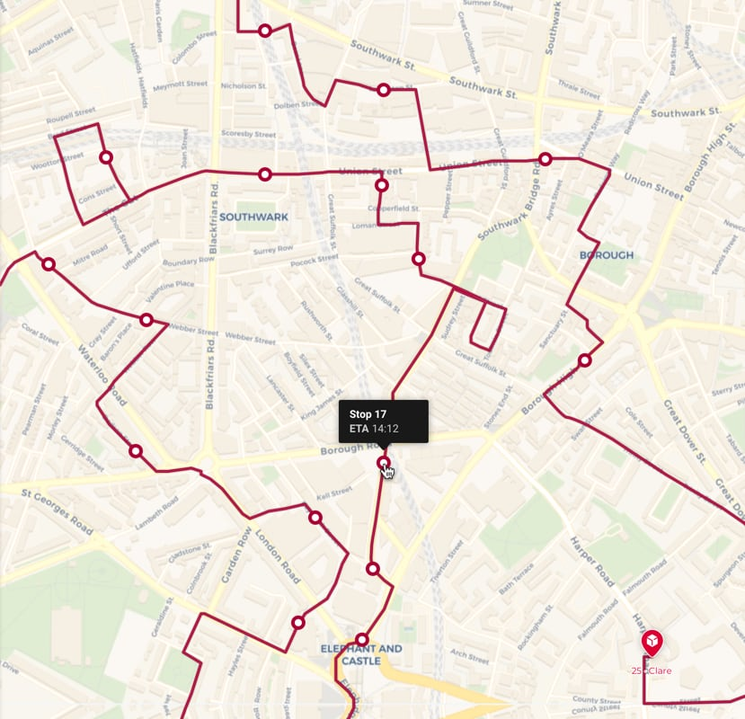
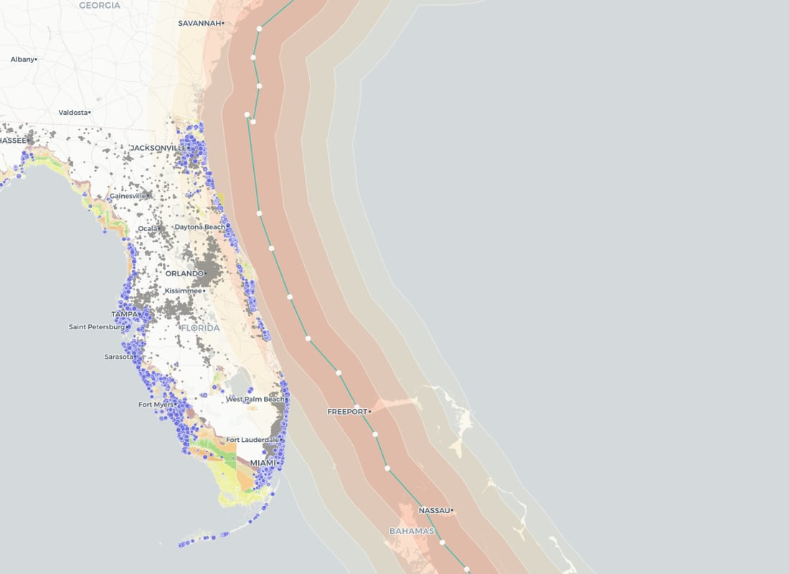
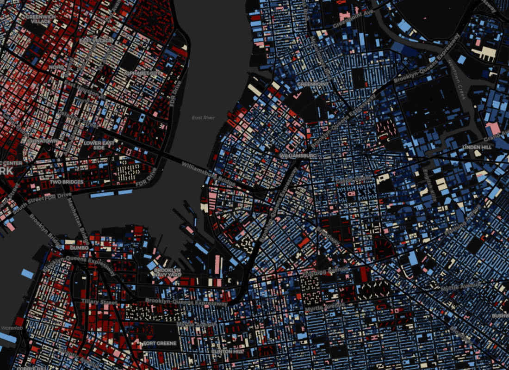
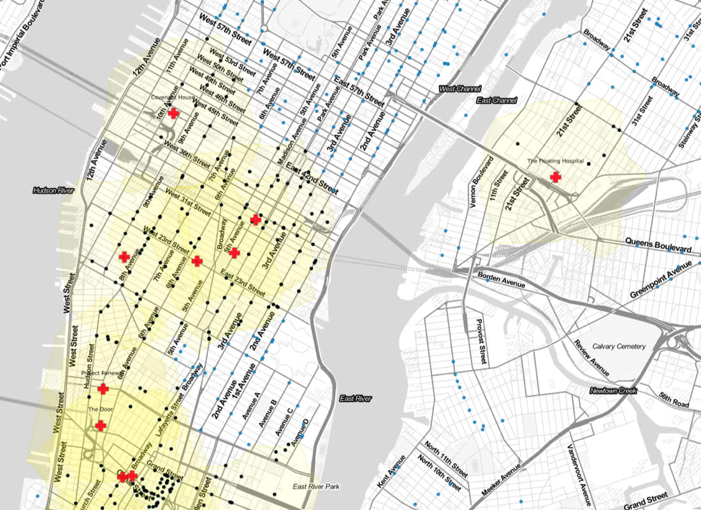
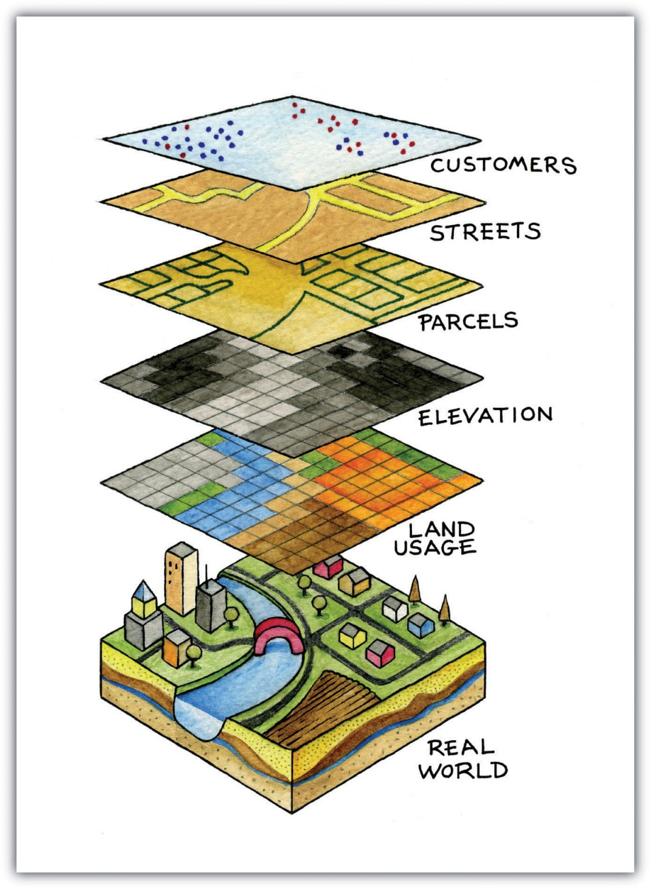
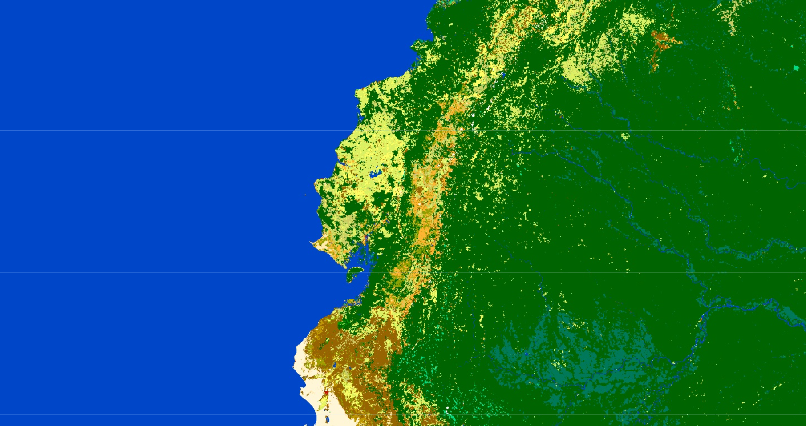

class: title-slide center middle
background-image: url(`r params$background_img`)
background-size: 105%

## `r rmarkdown::metadata$title`
#### `r rmarkdown::metadata$subtitle`

---
background-image: url(img/slide_nb.png)
background-position: top left
background-size: 140%
padding-top: 150px
class: center middle


## Importancia de los datos espaciales en la ciencia de datos 

.pull-left[


Los datos espaciales, también conocidos como **datos geoespaciales**, hacen referencia a la información que identifica la **ubicación geográfica** y las **características** de los elementos y límites naturales o construidos en la Tierra.

]

.pull-right[


]

---
background-image: url(img/slide_nb.png)
background-position: top left
background-size: 140%
padding-top: 150px
class: center middle

.left[

## Datos Espaciales

.pull-left[
Estos datos suelen representarse en términos de **coordenadas cartesianas (x,y)** para mapas bidimensionales, pero también pueden incluir la **altitud (z)** para una representación tridimensional. 

Los datos espaciales pueden adoptar diversas formas como:
- Puntos (GPS) 
- Líneas (carreteras o ríos) 
- Polígonos (fronteras, zonas de uso del suelo).]

]

.pull-right[


]

---
background-image: url(img/slide_nb.png)
background-position: top left
background-size: 140%
padding-top: 150px
class: center middle

## Casos de estudio 
Los datos espaciales son fundamentales en diversas áreas de la ciencia de datos debido a su **capacidad** para proporcionar información georreferenciada que puede revelar **patrones, tendencias y relaciones** que no son evidentes con datos no espaciales.

.pull-left[

### Optimización de la cadena de suministros

```{r, echo=FALSE}

```

]

.pull-right[
### Modelización de catástrofes

```{r, echo=FALSE}

```

]

---
background-image: url(img/slide_nb.png)
background-position: top left
background-size: 140%
padding-top: 150px
class: center middle

.pull-left[

### Análisis del mercado inmobiliario

```{r, echo=FALSE}

```

]

.pull-right[
###  Análisis sanitario

```{r, echo=FALSE}

```

]

---
background-image: url(img/slide_nb.png)
background-position: top left
background-size: 140%
padding-top: 250px
class: center 

## ¿Cómo se ven los datos espaciales?

.left-column[

Los dos modelos de datos más utilizados para almacenar datos geoespaciales son los **vectores** y **ráster**.

]

.right-column[
```{r, echo=FALSE, out.width="50%"}

```
]

---
background-image: url(img/slide_nb.png)
background-position: top left
background-size: 140%
padding-top: 150px
class: center middle

# Vectores 

.pull-left[
- Los datos vectoriales se componen de lugares geométricos discretos (valores x,y) conocidos como vértices que definen la **forma** del objeto espacial. 
- La organización de los vértices, determina el tipo de vector con el que estamos trabajando: punto, línea o polígono.

]

.pull-right[
```{r, echo=FALSE}
knitr::include_graphics("img/ejemplo_geometria_vectores.png")
```
]


---

background-image: url(img/slide_nb.png)
background-position: top left
background-size: 140%
padding-top: 150px
class: middle

# Raster 

- Los datos ráster o "cuadriculados" son datos que se guardan en **píxeles**. 
- En el mundo espacial, cada píxel representa un área de la superficie terrestre. Por ejemplo, en el ráster que se muestra a continuación, cada píxel representa una clase concreta de cubierta terrestre que se encontraría en ese lugar del mundo real.

.center[
```{r, echo=FALSE, out.width="50%"}

```

]

---
background-image: url(img/slide_nb.png)
background-position: top left
background-size: 140%
padding-top: 150px
class: middle

# ¿Cómo manipular estos datos?

Para este curso, emplearemos principalmente los siguientes paquetes: `sf`, `terra` y  `tidyverse`. 

### `sf`

.pull-left[

- **Simple features** es un modelo de datos jerárquico desarrollado y aprobado por el Open Geospatial Consortium (OGC) que representa una amplia gama de tipos de geometría.
- El paquete sf puede representar todos los tipos comunes de geometría vectorial: puntos, líneas, polígonos y sus respectivas versiones multi (que agrupan características del mismo tipo en una única característica). 

]


.pull-right[
```{r, echo=FALSE, out.width="50%"}
knitr::include_graphics("img/ejemplo_Sf_logo.png")
```

]

---

background-image: url(img/slide_nb.png)
background-position: top left
background-size: 140%
padding-top: 150px
class: center middle

## `terra`

.pull-left[

El paquete terra soporta objetos raster en R. Proporciona un amplio conjunto de funciones para crear, leer, exportar, manipular y procesar conjuntos de datos raster. 

]

.pull-right[
```{r, echo=FALSE, out.width="50%"}
knitr::include_graphics("img/ejemplo_terra.png")
```
]

---
background-image: url(img/slide_nb.png)
background-position: top left
background-size: 140%
padding-top: 150px
class: center middle


## `tidyverse`

.pull-left[

```{r, echo=FALSE}
knitr::include_graphics("img/ejemplo_tidyverse.png")
```

]

.pull-right[
El paquete tidyverse es una colección de paquetes orientados a la manipulación, importación, exploración y visualización de datos y que se utiliza exhaustivamente en ciencia de datos.

El uso de este paquete permite facilitar el trabajo estadístico y la generación de trabajos reproducibles. Está compuesto de los siguientes paquetes:

-   readr
-   dplyr
-   ggplot2
-   tibble
-   tidyr
-   purr
-   stringr
-   forcats

]


