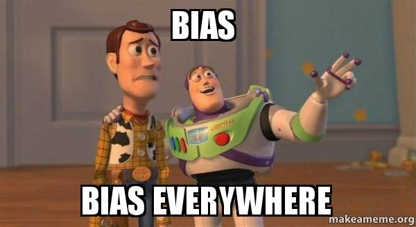

class: title-slide center middle
background-image: url(`r params$background_img`)
background-size: 105%

## `r rmarkdown::metadata$title`
#### `r rmarkdown::metadata$subtitle`

---
background-image: url(img/slide_nb.png)
background-position: top left
background-size: 140%
padding-top: 150px
class: center middle
## Sesgos y datos

```{r out.height=250,out.width=400,fig.align='center', echo=FALSE}



```

- Empleamos la modelación matemática para minimizar los *sesgos concientes o inconcientes*
- Sin embargo la interpretación de los datos y los resultados recaen en el ser humano
- En un mundo ideal buscamos ser **objetivos**. 
- Sin embargo, la influencia del ser humano puede perpetuar desigualdades.
- Para responder la pregunta de investigación debemos aplicar **supuestos**, esto puede modificar de forma implicita la manera que recolectamos e interpretamos los datos. 

---
background-image: url(img/slide_nb.png)
background-position: top left
background-size: 140%
padding-top: 150px
class: center middle


## Importancia de los datos espaciales en la ciencia de datos 

.pull-left[


Los datos espaciales, también conocidos como **datos geoespaciales**, hacen referencia a la información que identifica la **ubicación geográfica** y las **características** de los elementos y límites naturales o construidos en la Tierra.

]

.pull-right[


]

---
background-image: url(img/slide_nb.png)
background-position: top left
background-size: 140%
padding-top: 150px
class: center middle

.left[

## Datos Espaciales

.pull-left[
Estos datos suelen representarse en términos de **coordenadas cartesianas (x,y)** para mapas bidimensionales, pero también pueden incluir la **altitud (z)** para una representación tridimensional. 

Los datos espaciales pueden adoptar diversas formas como:
- Puntos (GPS) 
- Líneas (carreteras o ríos) 
- Polígonos (fronteras, zonas de uso del suelo).]

]

.pull-right[


]

---

class: inverse, center, middle

## Casos de estudio 

Los datos espaciales son fundamentales en diversas áreas de la ciencia de datos debido a su *capacidad* para proporcionar información georreferenciada que puede revelar *patrones, tendencias y relaciones* que no son evidentes con datos no espaciales.

---
background-image: url(img/slide_nb.png)
background-position: top left
background-size: 140%
padding-top: 150px
class: center middle


.pull-left[

### Optimización de la cadena de suministros

```{r, echo=FALSE,fig.height=250}
knitr::include_graphics("img/ejemplo_cadena_suministros.jpg")
```

]

.pull-right[
### Modelización de catástrofes

```{r, echo=FALSE}
knitr::include_graphics("img/ejemplo_catastrofes.jpg")
```

]

---
background-image: url(img/slide_nb.png)
background-position: top left
background-size: 140%
padding-top: 150px
class: center middle

.pull-left[

### Análisis del mercado inmobiliario

```{r, echo=FALSE}
knitr::include_graphics("img/ejemplo_mercado_inmobiliario.jpg")
```

]

.pull-right[
###  Análisis sanitario

```{r, echo=FALSE}
knitr::include_graphics("img/ejemplo_salud.jpg")
```

]

---
background-image: url(img/slide_nb.png)
background-position: top left
background-size: 140%
padding-top: 250px
class: center 

## ¿Cómo se ven los datos espaciales?

.left-column[

Los dos modelos de datos más utilizados para almacenar datos geoespaciales son los **vectores** y **ráster**.

]

.right-column[
```{r, echo=FALSE, out.width="50%"}
knitr::include_graphics("img/ejemplo_raster_vector.jpg")
```
]

---
background-image: url(img/slide_nb.png)
background-position: top left
background-size: 140%
padding-top: 150px
class:  middle

# Vectores 

.pull-left[
- Los datos vectoriales se componen de lugares geométricos discretos (valores x,y) conocidos como vértices que definen la **forma** del objeto espacial. 
- La organización de los vértices, determina el tipo de vector con el que estamos trabajando: punto, línea o polígono.

]

.pull-right[
```{r, echo=FALSE}
knitr::include_graphics("img/ejemplo_geometria_vectores.png")
```
]


---

background-image: url(img/slide_nb.png)
background-position: top left
background-size: 140%
padding-top: 150px
class: middle

# Raster 

- Los datos ráster o "cuadriculados" son datos que se guardan en **píxeles**. 
- En el mundo espacial, cada píxel representa un área de la superficie terrestre. Por ejemplo, en el ráster que se muestra a continuación, cada píxel representa una clase concreta de cubierta terrestre que se encontraría en ese lugar del mundo real.

.center[
```{r, echo=FALSE, out.width="50%"}
knitr::include_graphics("img/ejemplo_uso_suelo.PNG")
```

]

---
background-image: url(img/slide_nb.png)
background-position: top left
background-size: 140%
padding-top: 150px
class: middle

# ¿Cómo manipular estos datos?

Para este curso, emplearemos principalmente los siguientes paquetes: `sf`, `terra` y  `tidyverse`. 

### `sf`

.pull-left[

- **Simple features** es un modelo de datos jerárquico desarrollado y aprobado por el Open Geospatial Consortium (OGC) que representa una amplia gama de tipos de geometría.
- El paquete sf puede representar todos los tipos comunes de geometría vectorial: puntos, líneas, polígonos y sus respectivas versiones multi (que agrupan características del mismo tipo en una única característica). 

]


.pull-right[
```{r, echo=FALSE, out.width="50%"}
knitr::include_graphics("img/ejemplo_Sf_logo.png")
```

]

---

background-image: url(img/slide_nb.png)
background-position: top left
background-size: 140%
padding-top: 150px
class: center middle

## `terra`

.pull-left[

El paquete terra soporta objetos raster en R. Proporciona un amplio conjunto de funciones para crear, leer, exportar, manipular y procesar conjuntos de datos raster. 

]

.pull-right[
```{r, echo=FALSE, out.width="50%"}
knitr::include_graphics("img/ejemplo_terra.png")
```
]

---
background-image: url(img/slide_nb.png)
background-position: top left
background-size: 140%
padding-top: 150px
class:  middle


## `tidyverse`

.pull-left[

```{r, echo=FALSE}
knitr::include_graphics("img/ejemplo_tidyverse.png")
```

]

.pull-right[
El paquete tidyverse es una colección de paquetes orientados a la manipulación, importación, exploración y visualización de datos y que se utiliza exhaustivamente en ciencia de datos.

El uso de este paquete permite facilitar el trabajo estadístico y la generación de trabajos reproducibles. Está compuesto de los siguientes paquetes:

-   readr
-   dplyr
-   ggplot2
-   tibble
-   tidyr
-   purr
-   stringr
-   forcats

]

---
class: inverse, center, middle

# Antes de pasar a la parte práctica

---
background-image: url(img/slide_nb.png)
background-position: top left
background-size: 140%
padding-top: 150px
class: middle

## La *pipe* o escribir código como una oración

Pensemos en el juego del floron:

.center[
> El *florón* **está** en mis manos <br>
de mis manos ya **paso** <br>
las *monjitas carmelitas* <br>
se **fueron** a Popayan <br>
a **buscar** lo que han perdido <br>
debajo del arrayan

]

Vamos a identificar dos sujetos (en cursiva): *el floron*, y *las monjitas*. Escribamos este canción como si se tratara de código de R. Primero para el florón:

```{r, eval=FALSE}
## Objeto:
floron <- floroncito()

floron <- está(qué = floron, en = mis_manos)

floron <- pasó(qué = floron, de_donde = mis_manos, cuando = ya)

```

---
background-image: url(img/slide_nb.png)
background-position: top left
background-size: 140%
padding-top: 150px
class: middle

## La *pipe* o escribir código como una oración

Ahora para las monjitas carmelitas:

```{r, eval = FALSE}
## Objeto:
monjitas <- carmelitas()

monitas <- fueron(quienes = monjitas, donde = Popayan)

monitas <- buscar(quienes = monjitas, qué = lo_se_a_perdido, donde = debajo_arrayan)

```

Tanto para el florón como para las monjitas hemos descrito **verbos** y **sujetos**. Lo que en R se traduce como **funciones** y **objetos/argumentos**.

Podemos reescribir el caso de las monjitas:

```{r, eval = FALSE}
buscar(
  quienes = fueron(quienes = monjitas, 
                  donde = Popayan), # Despues de irse, buscan
  qué = lo_se_a_perdido, donde = debajo_arrayan
)

```

---
background-image: url(img/slide_nb.png)
background-position: top left
background-size: 140%
padding-top: 150px
class: middle

## La *pipe* o escribir código como una oración

En el primer caso, se entiende que es una **secuencia de pasos** que alteran el estado del **sujeto/objeto**. En el segundo caso se complica la lectura, pero el resultado es igual, R va a evaluar las funciones **de adentro hacia afuera**. Sin embargo podemos hacer más legible el código con una **pipe** o `%>%`:

**Floroncito:**

```{r, eval=FALSE}
floron <- floroncito() %>% 
  está(en = mis_manos) %>% 
  pasó(de_donde = mis_manos, cuando = ya)

```

**Monjitas:**

```{r, eval=FALSE}
monjitas <- carmelitas() %>% 
  fueron(donde = Popayan) %>% 
  buscar(qué = lo_se_a_perdido, donde = debajo_arrayan)

```

---
background-image: url(img/slide_nb.png)
background-position: top left
background-size: 140%
padding-top: 150px
class: middle

## La *pipe* o escribir código como una oración

Entonces la pipe nos permite:

- Componer funciones o secuencia de funciones
- Crear un codigo más legible

Pero debemos conocer sus alcances:

- La empleamos en una **secuencia de pasos** en las que se modifica un **objeto principal**
- No es recomendado unir más de 10 pasos
- Si necesitamos los resultados intermedios, es mejor no usarla

Para incluirla en nuestro código de forma sencilla usamos la combinación

.center[
`Ctrl + Shift + M`
]

---
background-image: url(img/slide_nb.png)
background-position: top left
background-size: 140%
padding-top: 150px
class: middle


## La *pipe* o escribir código como una oración

Empleemos la pipe para determinar los momentos de la distribución del *Número de empleados* en las empresas medianas tipo A, por sector de actividad en la ENESEM.

Primero descompongamos el ejercicio en pasos:

1. **Leemos** los *datos/tabla* del archivo
2. **Filtrar** los *datos/tabla* para las empresas medianas tipo A
2. **Calcular** con los *datos/tabla* el número total de empleados
3. **Agrupar** los *dato/tablas* por tamaño
4. **Calcular** con los *datos/tabla* los momentos de la distribución

> Primero filtramos para que las operaciones se realicen con menos observaciones

Fijemonos que se cumplen las condiciones para usar la pipe 😎


---
background-image: url(img/slide_nb.png)
background-position: top left
background-size: 140%
padding-top: 150px
class: middle

## La *pipe* o escribir código como una oración


```{r, echo=TRUE, message = FALSE}
library(haven) 
library(tidyverse) 

resumen <- read_sav("data/2020_ENESEM_BDD_TIC.sav") %>% 
  filter(des_tamano == "Mediana Empresa A") %>% 
  mutate(total_empleados = tic2_5_pers_ocup_h + tic2_5_pers_ocup_m) %>% 
  group_by(des_sector) %>% 
  summarise(
    media = mean(total_empleados, na.rm = TRUE),
    desviacion = sd(total_empleados, na.rm = TRUE),
    mediana = median(total_empleados, na.rm = TRUE),
    q25 = quantile(total_empleados, probs = 0.25, na.rm = TRUE),
    q75 = quantile(total_empleados, probs = 0.75, na.rm = TRUE),
    empresas = n()
  )


```

---
background-image: url(img/slide_nb.png)
background-position: top left
background-size: 140%
padding-top: 150px
class: middle

## La *pipe* o escribir código como una oración


```{r, echo=FALSE, message = FALSE}


resumen


```

---
background-image: url(img/slide_nb.png)
background-position: top left
background-size: 140%
padding-top: 150px
class: middle

## Intervalos de confianza para la media

En el ejemplo anterior empleamos la función `mutate` para crear la variable `total_empleados`. Para poder hacer inferencia estadística sobre **la diferencia de las medias** entre grupos podemos emplear los intervalos de confianza para las medias. 

$$
\bar{x} \pm z_{\alpha/2}\frac{\sigma}{\sqrt{n}}
$$
Con $\alpha = 0.05$ y $z\sim N(0,1)$:

```{r}

intervalo <- resumen %>% 
  
  # Creamos nuevas variables a partir del resultado anterior
  
  mutate(error_estandar = (qnorm(0.975)*desviacion)/sqrt(empresas),
         inferior = media - error_estandar,
         superior = media + error_estandar) %>% 
  
  # Elegimos las variables de interes
  
  select(des_sector,inferior,media,superior)

```

---
background-image: url(img/slide_nb.png)
background-position: top left
background-size: 140%
padding-top: 150px
class: middle


Vamos a ver estos valores de forma gráfica:

```{r}
plot <- intervalo %>% 
  # La pipe nos permitira llamar a las variables de tabla dentro
  # de las capas de ggplot:
  ggplot() +
  # Barras de error para el intervalo:
  geom_errorbar(mapping = aes(x = des_sector,
                              ymin = inferior,
                              ymax = superior),
                color = "orange", width = 0.2) +
  # Ploteamos la media
  geom_point(mapping = aes(x = des_sector,
                           y = media),
             color = "orange")

  

```


---

background-image: url(img/slide_nb.png)
background-position: top left
background-size: 140%
padding-top: 150px
class: middle

## Gráfico de los intervalos de confianza


```{r, echo=FALSE,fig.height=5,out.width=500,fig.align='center'}
plot +
  labs(y = "Número de empleados",
       x = "Actividad económica",
       title = "Intervalo de confianza para la media",
       subtitle = "Empresas medianas tipo A")
```

Podemos decir estadisticamente la las actividades de manufactura minería y servicios contratan más empleados con respecto a las actividades de comercio. No podemos decir lo mismo entre el comercio y la construcción.

---

background-position: top left
background-size: 140%
padding-top: 150px
class: inverse center middle

# Práctica: Comparando los sectores por tamaño

Vamos a replicar este análisis incluyendo en el análisis el tamaño y el sector. Recuerden abrir el proyecto y en un script de R vamos a ampliar el análisis.

---
background-image: url(img/slide_nb.png)
background-position: top left
background-size: 140%
padding-top: 150px
class: middle

## Condiciones

Ya sea para **filtrar** o para crear variables **lógicas** tenemos algunos operadores:

```{r, echo = FALSE}
knitr::kable(
tibble::tibble(
      Operador = c("<", "<=", ">", ">=", "==", "!=", "!x", "x | y", "x || y", 
                   "x & y",
                   "is.na(x)"),
   Descripción = c("Menor a", "Menor o igual a", "Mayor a",
                   "Mayor o igual a", "Igual",
                   "No igual", "No x", "x ó y (elemento a elemento)", 
                   "x ó y (de vectores)",
                   "'x' y 'y'", "¿Son vacios o missing?")
),
)
```

---
background-image: url(img/slide_nb.png)
background-position: top left
background-size: 140%
padding-top: 150px
class: middle

## Más reflexiones sobre los valores atípicos (outliers)

Recordemos de la distribución de la variable **logaritmo de inversión en TICS**:

```{r echo=FALSE,fig.height=5,fig.align='center', warning=FALSE,message=FALSE}

tabla <- read_sav("data/2020_ENESEM_BDD_TIC.sav") 

tabla <- tabla %>% 
  mutate(log_tic = log(tic1_2))

media <- mean(tabla$log_tic,na.rm = T)

tabla %>% 
  ggplot() +
  geom_histogram(aes(x = log(tic1_2)),
                 fill = "orange",
                 alpha = 0.6) +
  geom_vline(xintercept = media,
             color = "orange") +
   geom_text(aes(x = media -1 ,
                y = 100,
                label = round(media,3)),
             color = "orange") +
  theme_minimal() +
  labs(x = "log(Valor invertido en TIC)",
       y = "Empresas",
       title = "Inversión en tecnlogías de la informción",
       subtitle = "Todas las empresas, datos no ponderados")
  

```

---
background-image: url(img/slide_nb.png)
background-position: top left
background-size: 140%
padding-top: 150px
class: middle

## Más reflexiones sobre los valores atípicos: alternativas

La media truncada al 5% (2.5% en cada cola):

```{r echo=FALSE,fig.height=5,fig.align='center', warning=FALSE,message=FALSE}

tabla <- read_sav("data/2020_ENESEM_BDD_TIC.sav") 

tabla <- tabla %>% 
  mutate(log_tic = log(tic1_2),
         q025 = quantile(log_tic,probs = 0.025,na.rm = T),
         q975 = quantile(log_tic,probs = 0.975,na.rm = T),
         dummy = between(log_tic,q025,q975),
         dummy = factor(dummy)) 

media <- mean(tabla$log_tic,na.rm = T)

tabla %>% 
  ggplot() +
  geom_histogram(aes(x = log_tic,
                     alpha = dummy),
                 fill = "orange", show.legend = FALSE) +
  geom_vline(xintercept = media,
             color = "orange") +
  geom_text(aes(x = media -0.7 ,
                y = 100,
                label = round(media,3)),
             color = "orange") +
  scale_alpha_manual(values = c(0.2,0.6))  +
  
  theme_minimal() +
  labs(x = "log(Valor invertido en TIC)",
       y = "Empresas",
       title = "Inversión en tecnologías de la informción",
       subtitle = "Todas las empresas, datos no ponderados")
  

```

---
background-image: url(img/slide_nb.png)
background-position: top left
background-size: 140%
padding-top: 150px

## Más reflexiones sobre los valores atípicos: alternativas

La transformación **winsorize** al 95%:

```{r echo=FALSE,fig.height=5,fig.align='center', warning=FALSE,message=FALSE}

tabla <- read_sav("data/2020_ENESEM_BDD_TIC.sav") 

tabla <- tabla %>% 
  mutate(log_tic = log(tic1_2),
         q025 = quantile(log_tic,probs = 0.025,na.rm = T),
         q975 = quantile(log_tic,probs = 0.975,na.rm = T),
         log_tic= case_when(
           log_tic <= q025 ~ q025,
           log_tic >= q975 ~ q975,
           TRUE ~ log_tic
         ))  

media <- mean(tabla$log_tic,na.rm = T)

tabla %>% 
  ggplot() +
  geom_histogram(aes(x = log_tic),
                 fill = "orange",
                 alpha = 0.6) +
  geom_vline(xintercept = media,
             color = "orange") +
  geom_text(aes(x = media -0.7 ,
                y = 100,
                label = round(media,3)),
             color = "orange") +
  
  theme_minimal() +
  labs(x = "log(Valor invertido en TIC)",
       y = "Empresas",
       title = "Inversión en tecnologías de la informción",
       subtitle = "Todas las empresas, datos no ponderados")
  

```

---
class: inverse center middle

# Gracias por la atención