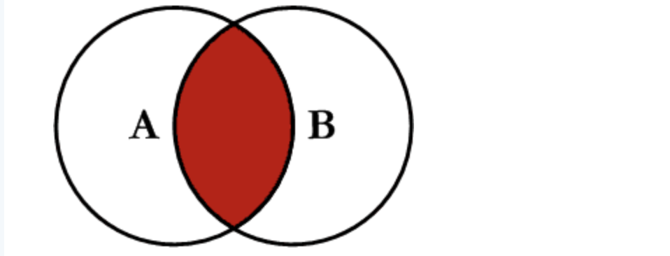
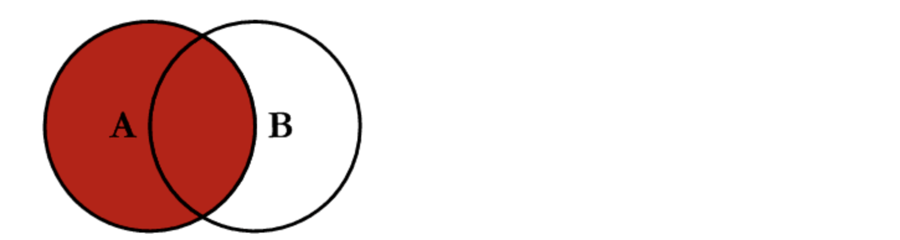
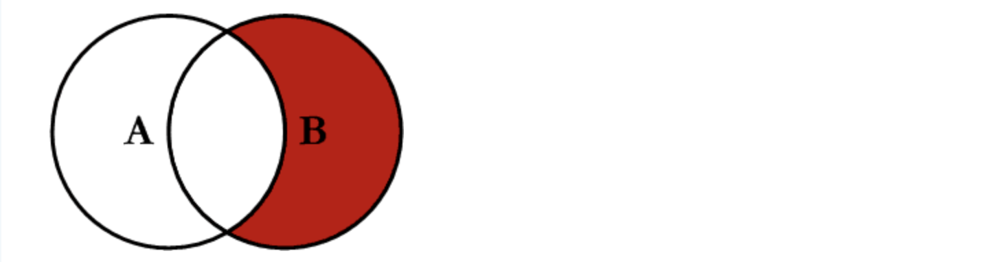
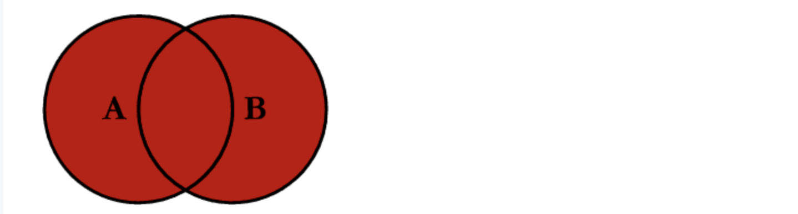

class: title-slide center middle
background-image: url(`r params$background_img`)
background-size: 105%

## `r rmarkdown::metadata$title`
#### `r rmarkdown::metadata$subtitle`

---
background-image: url(img/slide_nb.png)
background-position: top left
background-size: 140%
padding-top: 150px


## Shapefile 

Los datos geoespaciales en formato vectorial suelen almacenarse en formato `shapefile`.

.pull-left[
**Obligatorios**
- `.shp` datos geométricos.
- `.shx` índice posicional de los datos geométricos.
- `.dbf` almacena atributos de cada *shape*.

**Opcionales**
- `.prj` texto plano que describre la *proyección*.
- `.sbn` y `.sbx` índices espaciales.
]

.pull-right[

]

---
background-image: url(img/slide_nb.png)
background-position: top left
background-size: 140%
padding-top: 150px
class: middle

## Atributos de los datos vectoriales

.pull-left[
- Son todos los **datos descriptivos** asociados a **entidades geográficas**.
- Los atributos de un shapefile son similares a los campos o columnas de una hoja de cálculo. 
]

.pull-right[

]


---
background-image: url(img/slide_nb.png)
background-position: top left
background-size: 140%
padding-top: 150px
class: middle

## Metadatos de los datos vectoriales

Son datos acerca de los datos.

Los metadatos clave para todos los shapefiles incluyen:
- **Tipo de objeto**: la clase del objeto importado.
- **Sistema de referencia de coordenadas (CRS)**: la proyección de los datos.
- **Extensión**: el área geográfica que cubre el archivo shape.

---
background-image: url(img/slide_nb.png)
background-position: top left
background-size: 140%
padding-top: 150px
class: middle


---
background-image: url(img/slide_nb.png)
background-position: top left
background-size: 140%
padding-top: 150px


## GeoTIFF

- Los datos ráster suelen presentarse en formato `GeoTIFF`.
- Es una imagen con **referencia espacial** relacionada con el mundo real.
- Su extensión es `.tif`.


.center[

]
---
background-image: url(img/slide_nb.png)
background-position: top left
background-size: 140%
padding-top: 150px

## Metadatos de los datos raster 

Los metadatos clave para los raster incluyen:

- **Sistema de referencia de coordenadas (CRS)**: la proyección de los datos.
- **Extensión**: el área geográfica que cubre el raster.
- **Dimensión**: el tamaño del archivo en pixeles. 
- **Resolución**: el tamaño de cada pixel. 


---
background-image: url(img/slide_nb.png)
background-position: top left
background-size: 140%
padding-top: 150px

## Sistema de referencia de coordenadas (CRS)

- El CRS de los datos espaciales especifica el **origen** y la **unidad de medida** de las coordenadas espaciales. 
- Las localizaciones en la Tierra pueden referenciarse utilizando CRS no proyectadas (también llamadas geográficas) o proyectadas. 

.center[


  
]
---
background-image: url(img/slide_nb.png)
background-position: top left
background-size: 140%
padding-top: 150px

## CRS  geográfico

- Un **CRS  geográfico** utiliza *latitud* y *longitud* para representar ubicaciones en la superficie elipsoidal tridimensional de la Tierra. 
- **Latitud**: mide ángulos al norte o al sur del ecuador `0°` oscilando entre `-90° S` hasta `90° N`.
- **Longitud**: mide los ángulos al oeste o al este del primer meridiano oscilan entre `-180° W` hasta los `180° E`.

.center[

]

---
background-image: url(img/slide_nb.png)
background-position: top left
background-size: 140%
padding-top: 150px

## CRS proyectado

- Un **CRS proyectado** utiliza *coordenadas cartesianas* para referenciar una ubicación en una representación bidimensional de la Tierra.
- Todas las **proyecciones** producen alguna **distorsión** de la superficie terrestre y no pueden conservar simultáneamente todas las propiedades de **área, dirección, forma y distancia**.

.center[


]

---
background-image: url(img/slide_nb.png)
background-position: top left
background-size: 140%
padding-top: 150px
class: center middle

## Los mapas que han visto están mal 

[Ejemplo revelador](https://www.thetruesize.com/)


---
background-image: url(img/slide_nb.png)
background-position: top left
background-size: 140%
padding-top: 150px
class:  middle

## Proyección UTM 

- Es una **proyección cilíndrica** se proyecta el globo terráqueo sobre una superficie cilíndrica.
- Es una **proyección transversa** el eje del cilindro es coincidente con el eje ecuatorial.
- Mantiene el valor de los **ángulos**.
- Cada **zona UTM**, expresada por un **número de huso (1-60)** y una **letra de zona (C-X)** se descompone en **regiones rectangulares de 100 km de lado**.
- Los valores de las coordenadas **UTM (X e Y)** son **siempre positivos**; los ejes cartesianos X e Y se establecen sobre el huso, siendo el eje X el ecuador y el eje Y el meridiano.

---
background-image: url(img/slide_nb.png)
background-position: top left
background-size: 140%
padding-top: 150px
class: center middle


---
background-image: url(img/slide_nb.png)
background-position: top left
background-size: 140%
padding-top: 150px


## ¿Cómo se ve un lugar en distintas coordenadas?

.pull-left[
**Grados decimales**
- Latitud: `-0.2298500`  
- Longitud: `-78.5249500`

**UTM**
- Zona: `17S`
- X: `775495.16544253 E`  
- Y: `9974570.7854669 N`
]

.pull-right[

]

---
background-image: url(img/slide_nb.png)
background-position: top left
background-size: 140%
padding-top: 150px

## Códigos EPSG

- El **código EPSG** corresponde a las siglas, en inglés, de **European Petroleum Survey Group**, organización científica relacionada a la industria petrolera. 
- Elaboró una base de datos que contiene información a nivel mundial sobre los sistemas de referencia de coordenadas (nombre, tipo, código), proyecciones cartográficas, entre otros.

.center[


]

---

class: inverse, center, middle

## Unión de tablas


---

background-image: url(img/slide_nb.png)
background-position: top left
background-size: 140%
padding-top: 150px

class: middle
##¿Qué son los `join` y por qué son importantes?

Generalmente necesitamos combinar información de distintas tablas.

Obtener datos específicos de distintas tablas, y presentar la información de una mejor manera, resulta de ayuda para la toma de decisiones.

Entonces, la función `join()` nos permite asociar 2 o más tablas, **en base a una columna que tengan en común**.

---

background-image: url(img/slide_nb.png)
background-position: top left
background-size: 140%
padding-top: 150px

class: middle
## Función: inner_join()

Mantiene **solo** los registros comúnes de ambas bases. Esta función busca coincidencias entre 2 tablas, en función a una o más columnas que tienen en común. De tal modo que sólo la **intersección** se mostrará en los resultados.

```{r out.height=150,out.width=400,fig.align='center', echo=FALSE}



```

```{r, eval = FALSE, message=F}

inner_join(x = tabla_personas,
           y = tabla_vivienda,
           by = "id_hogar")

# O con la pipe:
tabla_personas %>% inner_join(tabla_vivienda) 

```

---
background-image: url(img/slide_nb.png)
background-position: top left
background-size: 140%
padding-top: 150px


class: middle
## Función: left_join()

Mantiene los registros de la base de la izquierda y rellena con `Nas` los registros que no estan en la base de la derecha. A diferencia de un `inner_join()`, donde se busca una intersección respetada por ambas tablas, con `left_join()` se da prioridad a la tabla de la **izquierda**, y se busca en la tabla derecha. Si no existe ninguna coincidencia para alguna de las filas de la tabla de la izquierda, de igual forma todos los resultados de la primera tabla se muestran.


```{r out.height=150,out.width=600,fig.align='center', echo=FALSE}



```

```{r, eval = FALSE, message=F}

left_join(x = tabla_personas,
           y = tabla_vivienda,
           by = "id_hogar")

```

---

background-image: url(img/slide_nb.png)
background-position: top left
background-size: 140%
padding-top: 150px


class: middle
## Función: rigth_join()

En el caso de `rigth_join()` la situación es muy similar, pero aquí se da prioridad a la tabla de la derecha. Es decir, mantiene los registros de la base de la derecha y rellena con `NAs` los registros que no estan en la base de la izquierda. De tal modo que si usamos dicha función, estaremos mostrando todas las filas de la tabla de la derecha.


```{r out.height=150,out.width=600,fig.align='center', echo=FALSE}



```

```{r, eval = FALSE, message=F}

right_join(x = tabla_personas,
           y = tabla_vivienda,
           by = "id_hogar")

```


---

background-image: url(img/slide_nb.png)
background-position: top left
background-size: 140%
padding-top: 150px


class: middle
## Función: full_join()

Mientras que `left_join()` muestra todas las filas de la tabla **izquierda**, y `rigth_join()` muestra todas las correspondientes a la tabla **derecha**, `full_join()` se encarga de mostrar **todas las filas** de ambas tablas, sin importar que no existan coincidencias (usará `NULL` como un valor por defecto para dichos casos). Es decir, mantiene todos los registros en ambas bases (coincidencias y no coincidencias).

```{r out.height=150,out.width=600,fig.align='center', echo=FALSE}



```

```{r, eval = FALSE, message=F}

full_join(x = tabla_personas,
           y = tabla_vivienda,
           by = "id_hogar")

```

---
background-image: url(img/slide_nb.png)
background-position: top left
background-size: 140%
padding-top: 150px


# Simulamos una base de datos

```{r, message=FALSE}

library(tidyverse)
library(gt)

set.seed(1984)

datos_sim <- tibble(
  id = sample(str_c("ID-",1:100),1000,replace = T),
  anio = sample(1936:1970,1000,replace = T),
  mes = sample(1:12,1000,replace = T),
  dia = sample(1:31,1000,replace = T),
  sexo = sample(c("Mujer","Hombre"),1000,replace = T),
  g_edad = sample(c("Joven","Adulto","Anciano"),1000,replace = T),
  valor = rpois(1000,300),
  ahorro = rpois(1000,100)
) 

```

En ocasiones sera importante simular datos, para este ejercicio haremos un ejercicio de compras y ahorro diario para 100 personas distintas durante los años 1936 y 1970. Los valores de compras vienen dados por una distribución Poisson con lambda 300 y el ahorro con un lambda de 100.
---
background-image: url(img/slide_nb.png)
background-position: top left
background-size: 140%
padding-top: 150px

## Diccionario de variables:

```{r, echo=FALSE}

tibble(Variables = names(datos_sim),
       `Descripción` = c("Identificador de la persona",
                         "Año de la compra",
                         "Mes de la compra",
                         "Día de la compra",
                         "Sexo del comprador",
                         "Grupo etario",
                         "Valor de la compra",
                         "Ahorro")) %>% 
  gt()

```

---
class: inverse, center, middle

# Como funciona `ggplot2`

---
background-image: url(img/slide_nb.png)
background-position: top left
background-size: 140%
padding-top: 150px

## Argumentos

Tabla:

```{r, eval=FALSE}
tabla %>%         #<<
  ggplot() + geom_{{tipo}}({{aes}}) 
```

Mapping:

```{r, eval=FALSE}
tabla %>% ggplot() + 
  geom_{{tipo}}( #<<
    {{aes}}) 
```

Aesthetic:

```{r, eval=FALSE}
tabla %>% ggplot() + geom_{{tipo}}( 
    {{aes}}   #<<
    ) 
```

...: Otros argumentos:

```{r, eval=FALSE}
tabla %>% ggplot() + geom_{{tipo}}( {{aes}},
                                    ...) #<<
```
---
background-image: url(img/slide_nb.png)
background-position: top left
background-size: 140%
padding-top: 150px

## Nube de puntos

Grafico básico:

```{r,fig.height=4,fig.align='center',fig.width=6}
ggplot(data = datos_sim) +
  geom_point(
    mapping = aes(x = valor, #<<
                  y = ahorro #<<
                  )          #<<
    )
datos_sim %>% 
  ggplot() +
  geom_point(
    mapping = aes(x = valor, #<<
                  y = ahorro #<<
    )          #<<
  )
```

---
background-image: url(img/slide_nb.png)
background-position: top left
background-size: 140%
padding-top: 150px

# Personalización

Añadir **color**, **size**, **alpha**, y **shape** en el aesthetic para hacer más bonito el gráfico.  

.pull-left[
### Shape:


]

.pull-right[
.left[
- `size`: Puede ser:
  - Un valor entero si deseo que todos los puntos tengan el mismo tamaño
  - Una variable numérica que determine el tamaño del punto
- `color:` Puede ser:
  - Un string con el nombre del color (en inglés)
  - Colores HTML (Ejemplo: '#d7215b')
- `alpha:` Valor entre 0 (transparente) y 1 (solido)

]
]


---
background-image: url(img/slide_nb.png)
background-position: top left
background-size: 140%
padding-top: 150px

### Dando formato al gráfico

```{r}
plot <- mpg %>% 
  ggplot() + 
  geom_point(aes(x = displ, 
                 y = hwy,
                 color = "red"),
             size = 4,           #<<     
             shape = 5,          #<<
             alpha = 0.5,        #<<
             show.legend = T) +  #<<
  geom_smooth(
    aes(x = displ,               #<<
        y = hwy),                #<<
    color = "blue",              #<<
    show.legend = T) +
  labs(title  = "Gráfico bonito",
       caption = "Elaborado por: Eric Blair",
       color = "Variable") +
  theme_bw()+
  theme(axis.text.x = element_text(angle = 90))
```

---
background-image: url(img/slide_nb.png)
background-position: top left
background-size: 140%
padding-top: 150px

# Gráfico personalizado

```{r,fig.height=5,fig.align='center',fig.width=7}
plot
```

---

class: inverse center middle

# Gracias por la atención
